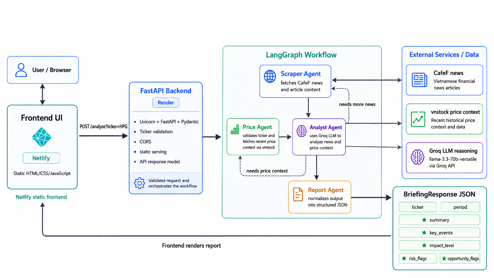

# Vietnamese Stock News Briefing

[](https://www.python.org/)
[](https://fastapi.tiangolo.com/)
[](https://langchain-ai.github.io/langgraph/)
[](https://vsnb.netlify.app)

An AI-assisted briefing tool for Vietnamese equities. Enter a ticker symbol and the app gathers recent company news, enriches it with price context, and returns a structured impact briefing with key events, risks, and opportunities.

**Live demo:** [vsnb.netlify.app](https://vsnb.netlify.app)  
**Backend health:** [Render API health check](https://vietnamese-stock-news-briefing-api.onrender.com/health)

> [!NOTE]
> Render's free tier may cold-start after inactivity, so the first request can take longer than usual.

> [!IMPORTANT]
> This project is an information summarization aid, not financial advice.

## Features

- Validate Vietnamese stock tickers against HOSE, HNX, and UPCOM data.
- Collect recent ticker-related news from CafeF.
- Fetch recent price context with `vnstock`.
- Coordinate scraping, price lookup, LLM analysis, and report formatting with LangGraph.
- Return a typed JSON briefing through FastAPI.
- Serve a lightweight static frontend deployable on Netlify.
- Cover key API, agent, prompt, and market-data helpers with pytest tests.

## Tech Stack

| Area | Tools |
| --- | --- |
| Backend API | FastAPI, Uvicorn, Pydantic |
| Agent workflow | LangGraph |
| LLM provider | Groq |
| Data sources | CafeF, vnstock |
| Scraping | requests, BeautifulSoup |
| Frontend | HTML, CSS, vanilla JavaScript |
| Testing | pytest, FastAPI TestClient |
| Hosting | Render, Netlify |

## Architecture



| Step | Responsibility |
| --- | --- |
| API route | Normalizes and validates ticker input, then starts the graph. |
| Scraper Agent | Retrieves and filters recent CafeF articles for the ticker. |
| Price Agent | Looks up exchange metadata and recent price movement. |
| Analyst Agent | Produces evidence-based analysis using the provided news and price context. |
| Report Agent | Converts model output into the API response schema. |

## API

### Health check

```http
GET /health
```

```json
{
  "status": "ok",
  "groq_configured": true
}
```

### Analyze a ticker

```http
POST /analyze?ticker=HPG
```

Response shape:

```json
{
  "ticker": "HPG",
  "period": "2026-05-29 to 2026-06-05",
  "summary": "Brief evidence-based impact summary.",
  "key_events": [
    {
      "date": "2026-06-01",
      "title": "Specific company event",
      "impact": "medium"
    }
  ],
  "impact_level": "medium",
  "risk_flags": ["Specific risk found in the news"],
  "opportunity_flags": ["Specific opportunity found in the news"]
}
```

## Local Development

### Prerequisites

- Python 3.11+
- Groq API key

### Setup

```bash
python -m venv .venv

# Windows
.venv\Scripts\activate

# macOS/Linux
source .venv/bin/activate

pip install -r requirements.txt
```

Create a local environment file:

```bash
# Windows
copy .env.example .env

# macOS/Linux
cp .env.example .env
```

Set your Groq key:

```env
GROQ_API_KEY=your_groq_api_key_here
API_HOST=0.0.0.0
API_PORT=8000
```

Run the application:

```bash
python main.py
```

Open:

- UI: <http://localhost:8000>
- API docs: <http://localhost:8000/docs>
- Health check: <http://localhost:8000/health>

## Testing

```bash
pytest tests/ -v
```

The test suite covers:

- API health and analysis routes.
- Ticker validation behavior.
- LangGraph routing decisions.
- Report formatting behavior.
- Price-context prompt integration.
- vnstock fetcher helpers.

## Project Structure

```text
.
|-- agents/              # LangGraph nodes and workflow state
|-- api/                 # FastAPI app, routes, response models
|-- crawlers/            # CafeF scraper and vnstock fetcher
|-- frontend/            # Static HTML/CSS/JS interface
|-- prompts/             # LLM system and formatting prompts
|-- tests/               # pytest test suite
|-- main.py              # Local backend entrypoint
|-- render.yaml          # Render service config
|-- netlify.toml         # Netlify frontend config
`-- requirements.txt     # Python dependencies
```

## Current Limitations

- CafeF and vnstock are third-party sources; availability and response formats can change.
- Free-tier hosting can introduce cold starts.
- LLM output is constrained and formatted, but still depends on source quality and model behavior.
- Scraping currently uses synchronous requests, which is acceptable for a small demo but should be revisited for heavier traffic.

## Roadmap

- Add caching for repeated ticker requests.
- Add CI for automated test runs on pull requests.
- Add richer frontend states for cold starts and source-level citations.
- Add request timeout guards and rate limiting for public usage.
- Expand source coverage beyond CafeF.
