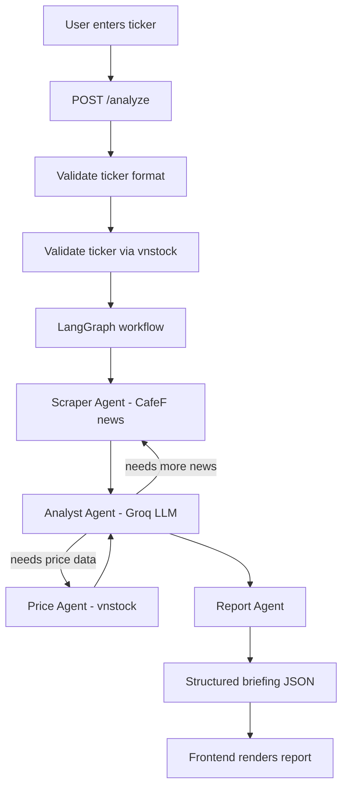

# Vietnamese Stock News Briefing

An AI-assisted briefing tool for Vietnamese equities. The application gathers recent company news, enriches it with market data, and returns a structured impact briefing for a requested stock ticker.

The project is designed as a small production-style full-stack system: a FastAPI backend, a static frontend, an agentic analysis pipeline, deployment configuration for Render and Netlify, and automated tests for the core API/agent behavior.

## Live Demo

- Frontend: https://vsnb.netlify.app
- Backend health check: https://vietnamese-stock-news-briefing-api.onrender.com/health

Render's free tier may cold-start after a period of inactivity, so the first request can take longer than usual.

## What It Does

- Validates Vietnamese stock tickers against HOSE, HNX, and UPCOM data.
- Scrapes recent stock-related news from CafeF.
- Fetches recent price context with `vnstock`.
- Uses a LangGraph workflow to coordinate scraping, price lookup, LLM analysis, and report formatting.
- Produces a structured JSON briefing with summary, key events, impact level, risks, and opportunities.
- Provides a lightweight web UI deployable as static files.

## Why This Project Matters

Stock news is noisy. A retail investor often needs to know not just what happened, but whether the event is likely to matter in the short term.

This project demonstrates:

- Agent orchestration with conditional routing and retries.
- Real-world data ingestion from third-party sources.
- LLM prompting for constrained financial analysis.
- API design with validation, typed response models, and error handling.
- Deployment-aware full-stack configuration for free hosting platforms.
- Automated tests around routes, agents, and market-data helpers.

This is not financial advice. The output is intended as an information summarization aid.

## Tech Stack

| Layer | Technology |
| --- | --- |
| Backend | FastAPI, Uvicorn, Pydantic |
| Agent workflow | LangGraph |
| LLM provider | Groq |
| Market data | vnstock |
| News source | CafeF |
| Frontend | HTML, CSS, vanilla JavaScript |
| Testing | pytest, FastAPI TestClient |
| Deployment | Render, Netlify |

## Architecture



## API

### Health Check

```http
GET /health
```

Example response:

```json
{
  "status": "ok",
  "groq_configured": true
}
```

### Analyze Ticker

```http
POST /analyze?ticker=HPG
```

Example response shape:

```json
{
  "ticker": "HPG",
  "period": "2026-05-29 to 2026-06-05",
  "summary": "Brief evidence-based impact summary.",
  "key_events": [
    {
      "date": "2026-06-01",
      "title": "Specific company event",
      "impact": "medium"
    }
  ],
  "impact_level": "medium",
  "risk_flags": ["Specific risk found in the news"],
  "opportunity_flags": ["Specific opportunity found in the news"]
}
```

## Local Development

### Prerequisites

- Python 3.11+
- Groq API key

### Setup

```bash
python -m venv .venv

# Windows
.venv\Scripts\activate

# macOS/Linux
source .venv/bin/activate

pip install -r requirements.txt
```

Create a local environment file:

```bash
# Windows
copy .env.example .env

# macOS/Linux
cp .env.example .env
```

Set your Groq key:

```env
GROQ_API_KEY=your_groq_api_key_here
API_HOST=0.0.0.0
API_PORT=8000
```

Run the backend:

```bash
python main.py
```

Open:

- UI: http://localhost:8000
- API docs: http://localhost:8000/docs
- Health check: http://localhost:8000/health

## Testing

```bash
pytest tests/ -v
```

The tests cover:

- API health and analysis routes.
- Ticker validation behavior.
- LangGraph routing decisions.
- Report formatting behavior.
- Price-context prompt integration.
- vnstock fetcher helpers.

## Project Structure

```text
.
|-- agents/              # LangGraph nodes and workflow state
|-- api/                 # FastAPI app, routes, response models
|-- crawlers/            # CafeF scraper and vnstock fetcher
|-- frontend/            # Static HTML/CSS/JS interface
|-- prompts/             # LLM system/user prompts and JSON formatter prompt
|-- tests/               # pytest test suite
|-- main.py              # Local backend entrypoint
|-- render.yaml          # Render deployment config
|-- netlify.toml         # Netlify deployment config
`-- requirements.txt     # Python dependencies
```

## Current Limitations

- CafeF and vnstock are third-party sources; availability and response format can change.
- Free-tier hosting may introduce cold starts.
- The LLM output is constrained and formatted, but it still depends on source quality and model behavior.
- The application currently uses synchronous scraping calls, which is acceptable for a small demo but should be revisited for heavier traffic.

## Future Improvements

- Add caching for repeated ticker requests.
- Add CI with automated test runs on pull requests.
- Add richer frontend states for cold starts and source-level citations.
- Add rate limiting and request timeout guards for public deployment.
- Expand source coverage beyond CafeF.
